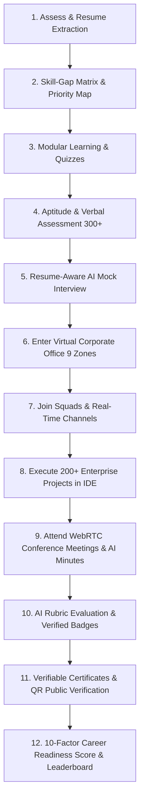

# 🏢 V-CORP — Virtual Corporate Experience, AI Skill Mapping & Career Readiness Platform

> **Smart India Hackathon (SIH) 2026** — *From Classroom Skills to Corporate Readiness.*

[](https://www.typescriptlang.org/)
[](https://reactjs.org/)
[](https://nodejs.org/)
[](https://www.mongodb.com/)
[](https://socket.io/)
[](https://tailwindcss.com/)

---

## 🌟 Executive Summary

**V-CORP** is an authentic, full-stack virtual corporate ecosystem engineered to bridge the critical gap between academic curriculum and corporate job readiness for college students across India.

Rather than static tutorials or simulated mockups, V-CORP places candidates into high-fidelity enterprise environments featuring **200+ unique industry projects**, **336 assessment questions**, **resume-aware multi-turn AI mock interviews**, **WebRTC live video conference rooms**, **real-time Socket.IO team squads**, **in-portal IDE/Spreadsheet/Document sandboxes**, and **cryptographically verifiable digital credentials with QR code validation**.

---

## 🚀 Complete Student Journey



---

## 📊 Core Features & System Capabilities

### 1. 🎯 Career Readiness Calculation Engine (0–100 Index)
- **10 Mathematical Weighted Factors**: Resume (10%), Skills (15%), Aptitude (10%), Logical Reasoning (10%), Verbal (10%), AI Mock Interview (15%), Projects & Tasks (20%), Communication (5%), Teamwork (2.5%), Problem Solving (2.5%).
- **5 Readiness Tiers**: Beginner (0–40), Developing (41–60), Job Ready (61–75), Highly Job Ready (76–90), Industry Ready (91–100).
- Visualized via **Interactive Radar Charts** and **Progress Metrics**.

### 2. 📄 AI Resume Parser & Role Matching
- Parses PDF, DOC, DOCX, and raw text.
- Extracts structured competencies: Education, Skills, Internships, Projects, Certifications.
- Computes **Role Compatibility %** and identifies critical missing skill gaps with tailored recommendations.

### 3. 🧠 Comprehensive Assessment Engine (336+ Questions)
- **3 Categories**: Quantitative Aptitude (16 topics, 112 Qs), Logical Reasoning (14 topics, 112 Qs), Verbal Ability (14 topics, 112 Qs).
- **4 Testing Modes**: Practice Mode (Instant Formulas), Timed Test (Countdown Timer), Corporate Screening Mock, Adaptive Scaling.
- Interactive question navigation palette (Answered, Marked for Review, Unvisited, Current), real-time countdown, and full formula solutions.

### 4. 🎙️ Resume-Aware AI Mock Interview Studio
- Dynamic multi-turn conversational loop with contextual follow-ups adapting to candidate answers.
- Dual input support: **Speech Recognition (Voice)** + **Text Fallback**.
- **Speech Synthesis (Audio Readout)** of AI recruiter questions.
- **9-Dimension Rubric Scoring**: Communication, Confidence, Clarity, Grammar, Technical Knowledge, Problem Solving, Relevance, Domain Knowledge, and Answer Quality.

### 5. 🏢 Virtual Corporate Office & Company Workspaces (9 Zones)
- **9 Functional Interactive Zones**: Reception, My Desk, Project Room, Conference Room, Team Area, Learning Zone, HR Studio, Performance Zone, Credential Center.
- Enterprise Workspaces inspired by **TCS, Deloitte, EY, KPMG**, and High-Growth Tech/Finance/Analytics firms.

### 6. 📁 200+ Enterprise Projects & In-Portal IDE Workspace
- **20 Projects per Role** across 10 Career Roles (5 Beginner, 10 Intermediate, 5 Advanced).
- In-portal multi-modal workspace with **Live Code Editor**, **Spreadsheet Grid**, **Markdown Document Editor**, and **File Dropzone**.
- Automated AI task evaluation across Accuracy (25), Problem Solving (25), Industry Relevance (20), Presentation (15), and Technical Quality (15).

### 7. 👥 Agile Squad Hub & Real-Time Socket.IO Channels
- Squad formation with auto-generated join codes (e.g. `VC-BA-4821`).
- Designated member roles: *Team Leader, Developer, Analyst, Researcher, Presenter, Documentation Lead*.
- Multi-channel real-time chat: `#general`, `#project-discussion`, `#technical`, `#announcements`.
- Live WebSocket broadcasts for instant task milestone updates.

### 8. 📹 WebRTC Live Conference Meetings & AI Minutes
- Real-time video/audio conference with camera, microphone, and screen share controls.
- Collaborative meeting notes with decisions and assigned action item checklists.
- **Automated AI Meeting Minutes Generator**.

### 9. 🏆 Verifiable Digital Credential Wallet & Public QR Verification
- Cryptographically signed certificates and 11+ verified skill badges.
- Dynamic **QR Code generation** for instant recruiter validation.
- Public validation route: `/verify/certificate/:id` and `/verify/badge/:id`.
- One-click **LinkedIn Sharing** with pre-formatted corporate posts.

### 10. 🤖 Context-Aware "V-CORP Assist" Chatbot
- Floating AI workplace companion with real-time page context detection.
- Quick action chips: *Get Hint, Explain Concept, Give Example, Check My Approach, Explain Skill*.

---

## ⚡ Quick Start & Installation

### Prerequisites
- **Node.js**: v18.0.0 or later (Tested on Node.js LTS v24.19.0)
- **MongoDB**: Local MongoDB server or MongoDB Atlas (`mongodb://127.0.0.1:27017/vcorp_db`)

### 1. Clone & Install Dependencies
```bash
# Clone the repository
git clone https://github.com/v-corp/v-corp-platform.git
cd v-corp

# Install backend dependencies
cd server
npm install

# Install frontend dependencies
cd ../client
npm install
```

### 2. Configure Environment Variables
Create `.env` in the `/server` directory:
```env
PORT=5000
MONGODB_URI=mongodb://127.0.0.1:27017/vcorp_db
JWT_SECRET=vcorp_jwt_secret_key_sih2026_super_secure_production_token
CLIENT_URL=http://localhost:5173
AI_PROVIDER=local
STORAGE_PROVIDER=local
MEETING_PROVIDER=webrtc
```

### 3. Seed Database with 200 Projects & 336 Questions
```bash
cd server
npm run seed
```

### 4. Run Automated Integration Test Suite
```bash
cd server
npm run test
```

### 5. Launch Full-Stack Application
```bash
# Terminal 1: Backend Server (Port 5000)
cd server
npm run dev

# Terminal 2: Frontend Client (Port 5173)
cd client
npm run dev
```

Open [http://localhost:5173](http://localhost:5173) in your browser.

---

## 🔑 Demo Credentials (1-Click SIH Judge Login)

| Role | Email | Password | Pre-configured Data |
|---|---|---|---|
| **Demo Student** | `demo@vcorp.local` | `Demo@12345` | Resume parsed, 88/100 Readiness Score, 2 projects, Squad `VC-BA-4821`, 2 Certificates, 6 Badges, Rank #1 |
| **Demo Admin** | `admin@vcorp.local` | `Admin@12345` | Cohort analytics, institutional metrics, curriculum management |

---

## 🏗️ Project Architecture

```
v-corp/
├── client/                     # Frontend React + TypeScript + Vite Application
│   ├── src/
│   │   ├── api/                # Axios interceptors & API client
│   │   ├── components/         # Navbar, Sidebar, Chatbot, Modals
│   │   ├── context/            # AuthContext, SocketContext
│   │   ├── pages/              # 16 Routed Full-Stack Views
│   │   ├── shared/             # Domain Types & Constants
│   │   ├── App.tsx             # Route Configuration
│   │   └── main.tsx            # React Entrypoint
│   ├── package.json
│   └── vite.config.ts
├── server/                     # Backend Node.js + Express + Socket.IO Server
│   ├── src/
│   │   ├── controllers/        # 13 REST Route Controllers
│   │   ├── middleware/         # JWT Auth, Multer, Error Handlers
│   │   ├── models/             # 20+ Mongoose Data Models
│   │   ├── routes/             # Express API Route Declarations
│   │   ├── services/           # AI Engine, Readiness Formula, Resume, WebSockets
│   │   ├── scripts/            # Database Seeder & Test Suite
│   │   └── index.ts            # Server Entrypoint
│   ├── package.json
│   └── tsconfig.json
├── shared/                     # Shared TypeScript Contracts & Domain Models
│   ├── constants.ts            # 10 Roles, 9 Companies, 44 Topics, 11 Badges
│   └── types.ts                # TypeScript Interfaces
├── docs/                       # Comprehensive System Documentation
│   ├── ARCHITECTURE.md         # System Architecture & Component Interactions
│   ├── API.md                  # REST & WebSocket API Documentation
│   ├── DATABASE.md             # Data Models & Schemas
│   ├── DEPLOYMENT.md           # Production Deployment Guide
│   └── DEMO.md                 # Step-by-Step SIH Demo Walkthrough
└── package.json                # Unified Monorepo Runner
```

---

## 📜 License
Developed for the **Smart India Hackathon 2026**. Open source under the MIT License.
