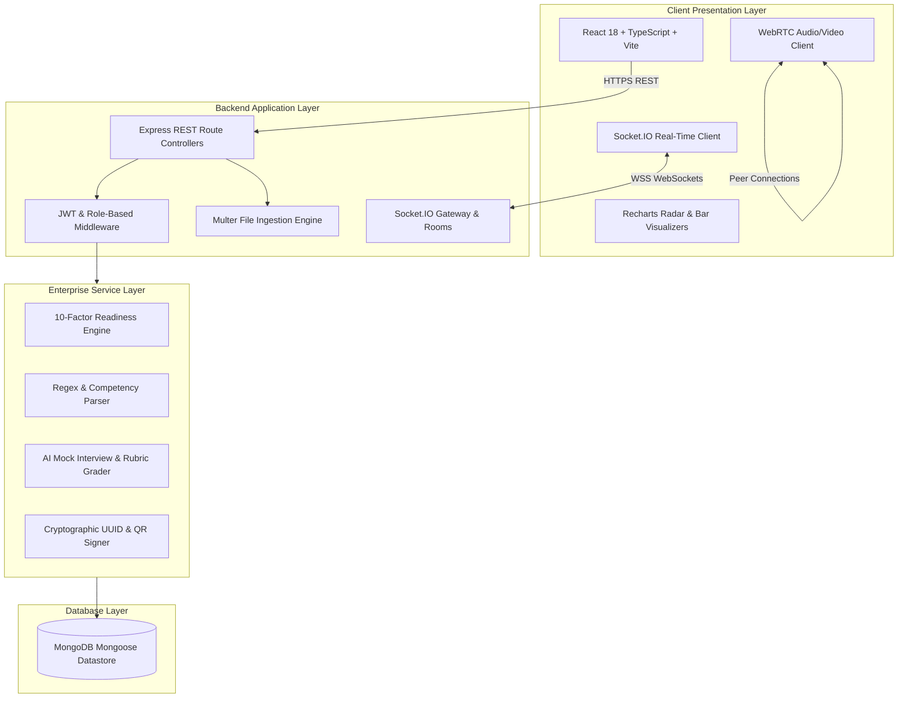

# 🏛️ V-CORP — System Architecture & Design Specification

## 1. High-Level Architecture Overview

V-CORP is architected as a modular, decoupled full-stack platform consisting of four core subsystems:
1. **Client Tier (Presentation Layer)**: Single Page Application (SPA) built with React 18, TypeScript, Vite, and Tailwind CSS.
2. **Application Server Tier (Business Logic Layer)**: Node.js / Express server exposing RESTful APIs and WebSocket endpoints with strict TypeScript typing.
3. **Real-Time Communication Tier**: Socket.IO server handling multi-channel squad chat, live task state synchronization, and WebRTC signaling.
4. **Data & AI Tier**: MongoDB with Mongoose ODM for persistence, paired with high-performance local & configurable AI reasoning engines for resume parsing, mock interviews, task grading, and meeting minutes.

---

## 2. Key Architectural Modules

### 2.1. 10-Factor Mathematical Readiness Scoring Engine
The Career Readiness Score ($CRS$) is a weighted sum defined by:
$$CRS = \sum_{i=1}^{10} w_i \cdot C_i$$

Where each weight $w_i$ is calibrated to industry standards:
- $w_{\text{resume}} = 0.10$
- $w_{\text{skills}} = 0.15$
- $w_{\text{aptitude}} = 0.10$
- $w_{\text{logical}} = 0.10$
- $w_{\text{verbal}} = 0.10$
- $w_{\text{interview}} = 0.15$
- $w_{\text{projects}} = 0.20$
- $w_{\text{communication}} = 0.05$
- $w_{\text{teamwork}} = 0.025$
- $w_{\text{problemSolving}} = 0.025$

### 2.2. Real-Time WebSocket Infrastructure
The Socket.IO service manages dedicated virtual rooms:
- `user_<userId>`: Targeted individual notifications, badge alerts, and interview reminders.
- `team_<teamId>`: Broadcasts channel messages across `#general`, `#project-discussion`, `#technical`, and `#announcements`.
- Real-time task change events (`task_updated`) emit live toasts across all active squad members without page refresh.

### 2.3. AI Rubric Evaluation Engine
Task deliverables submitted through the in-portal IDE/Spreadsheet/Document sandboxes undergo automated rubric evaluation across 5 standardized dimensions:
1. **Accuracy & Correctness** (25 pts)
2. **Problem-Solving Rigor** (25 pts)
3. **Industry Relevance** (20 pts)
4. **Presentation & Clarity** (15 pts)
5. **Technical Quality** (15 pts)
Total = 100 pts. Submissions scoring $\ge 80$ automatically generate verified cryptographic task credentials.

### 2.4. Cryptographic Credential & QR Verification
Every issued certificate receives a unique SHA-256 derived UUID (`VCORP-CERT-XXXXXX`). The backend exposes a non-sensitive public endpoint `/api/credentials/verify/:id` that allows employers, recruiters, and colleges to verify the authenticity, score, issuer, and date of completion.
